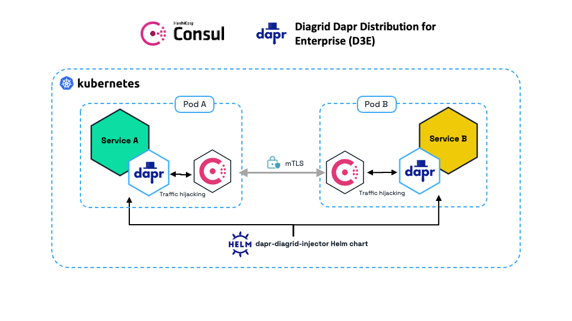
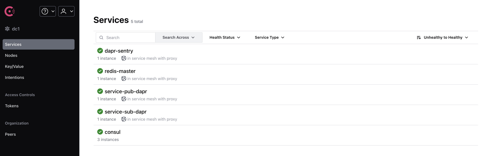

# D3E Sample Application Guide - Hashicorp Consul

This guide demonstrates how to run the Diagrid D3E (Dapr) sample application, which showcases a publisher-subscriber pattern using Redis as the backing store alongside Hashicorp Consul service mesh. This is a unique deployment scenario as *no Dapr control plane components* are deployed and should only be used in special cases. This setup disables mTLS in Dapr and allows only the `diagrid-dapr-injector` library Helm chart to be used to "inject" the Daprd sidecar into the sample app application pods.



## Overview

The sample application consists of:
- **Publisher Service** (`service-pub`): Publishes messages to a Redis pub/sub topic every 5 seconds
- **Subscriber Service** (`service-sub`): Subscribes to the topic and stores received messages in Redis state store
- **Redis**: Used for both pub/sub messaging and state storage
- **diagrid-dapr-injector-helm chart**: A library chart that is a dependency for the applications.

## Prerequisites

Before running the sample, ensure you have the following installed:

- A Kubernetes cluster with sufficient resources to run Consul, Dapr etc.
- [Docker](https://docs.docker.com/get-docker/)
- [kubectl](https://kubernetes.io/docs/tasks/tools/)
- [Helm](https://helm.sh/docs/intro/install/)

## Quick Start

### 1. Install Redis on your cluster

Set up the local Kubernetes cluster with Redis acting as the message broker and state store. The following Helm values are included to allow Redis to be meshed as part of the service mesh:

```yaml
  podAnnotations:
    consul.hashicorp.com/transparent-proxy: "false"
    consul.hashicorp.com/connect-inject: "true"
    consul.hashicorp.com/connect-service: "redis-master"
```

Install Redis:

```bash
kubectl create namespace d3e-sample # Create the d3e-sample namespace if it is not already created

helm upgrade --install redis oci://registry-1.docker.io/bitnamicharts/redis --version 22.0.3 -n d3e-sample -f redis/values-redis.yaml  
```

### 2. Install Hashicorp Consul

This installation of Consul enables `connectInject` which creates service mesh sidecar proxies that are injected via a [mutating admission webhook](https://developer.hashicorp.com/consul/docs/connect/k8s/inject). It also enables `transparentProxy` mode which forces all traffic within the pod to go through the sidecar proxy. Read [consul-values.yaml](./consul/consul-values.yaml) before installing and add any additional configuration needed for your setup.

```bash
# Consul installation
helm install --values consul/consul-values.yaml consul hashicorp/consul --create-namespace --namespace consul --version "1.0.0"

export CONSUL_HTTP_TOKEN=$(kubectl get --namespace consul secrets/consul-bootstrap-acl-token --template={{.data.token}} | base64 -d)                                                                     
export CONSUL_HTTP_ADDR=https://$(kubectl get services/consul-ui --namespace consul -o jsonpath='{.status.loadBalancer.ingress[0].ip}')                                                                    
export CONSUL_HTTP_SSL_VERIFY=false # To access the Consul UI insecurely.
echo $CONSUL_HTTP_TOKEN 

# For sequential Helm upgrades, use the following command
# helm upgrade --install --values consul-values.yaml consul hashicorp/consul --create-namespace --namespace consul
```

View the Consul UI at the External IP exposed by the `consul-ui` service. Initially the services will not show up, but at the end, the dashboard should look something like this:



### 3. Deploy the Sample Application

Deploy the publisher and subscriber services with the dependency Helm chart as the `diagrid-injector-helm-chart`:

Update Helm dependencies if you haven't already:

```bash
helm dependency update . 
```

```bash
make sample
```

This command installs the Helm chart with:

- Publisher service (`service-pub`) that publishes messages every 5 seconds
- Subscriber service (`service-sub`) that receives and stores messages
- Redis for pub/sub and state storage
- Dapr components (pubsub, statestore, secret store)

## Understanding the Sample

### Application Architecture

```
┌─────────────────┐    ┌─────────────────┐    ┌─────────────────┐
│   service-pub   │───▶│   Redis Pub/Sub │───▶│   service-sub   │
│   (Publisher)   │    │     broker      │    │   (Subscriber)  │
└─────────────────┘    └─────────────────┘    └─────────────────┘
                                                      │
                                                      ▼
                                             ┌─────────────────┐
                                             │   Redis State   │
                                             │     Store       │
                                             └─────────────────┘
```

### Publisher Service (`samples/pub/main.go`)

The publisher service:

- Connects to Dapr using the Go SDK
- Publishes messages every 5 seconds to the `pubsub` component
- Each message contains:
  - Unique ID (UUID)
  - Timestamp
  - Content with current time
- Runs an HTTP health check endpoint on port 8080

```go
// Key publishing logic
func (s *service) publish() error {
    msg := message{
        ID:        uuid.New().String(),
        Timestamp: time.Now(),
        Content:   fmt.Sprintf("Message published at %s", time.Now().Format(time.RFC3339)),
    }
    // Publish to Redis via Dapr
    err := s.client.PublishEvent(context.Background(), pubsubName, topic, msgBytes)
    return err
}
```

### Subscriber Service (`samples/sub/main.go`)

The subscriber service:

- Subscribes to the `pubsub` topic
- Processes incoming messages
- Stores each message in the Redis `statestore` using the message ID as the key
- Logs all processing activities

```go
// Message handling
func (s *service) handleMessage(ctx context.Context, e *common.TopicEvent) (retry bool, err error) {
    // Parse message
    var msg message
    json.Unmarshal(jsonData, &msg)
    
    // Store in Redis state store
    key := msg.ID
    err = s.client.SaveState(ctx, "statestore", key, jsonData, nil)
    return false, nil
}
```

### Dapr Components

The sample uses several Dapr components:

1. **PubSub Component** (`resources/components/pubsub.yaml`):
   - Type: `pubsub.redis`
   - Connects to Redis for message queuing
   - Scoped to both publisher and subscriber services

2. **State Store Component** (`resources/components/statestore.yaml`):
   - Type: `state.redis`
   - Used by subscriber to persist received messages
   - Connects to the same Redis instance

3. **Secret Store** (`resources/components/kubernetessecretstore.yaml`):
   - Provides secure access to Redis credentials
   - Uses Kubernetes secrets for credential management


### Hashicorp Consul Configuration

Consul requires a Service Account and single K8s Service of the same name as the application to map communications to "meshed" applications. Read the docs [here](https://developer.hashicorp.com/consul/docs/connect/k8s/workload).

In this case we are deploying two Service Accounts, one for each Dapr-enabled application. We are using the existing `-dapr` Kubernetes services and creating Service Accounts of the same name.

``` yaml
apiVersion: v1
kind: ServiceAccount
metadata:
  name: service-sub-dapr
---
apiVersion: v1
kind: ServiceAccount
metadata:
  name: service-pub-dapr
```

Then we are using these Service Accounts to the pod specifications on each Dapr application as follows, for example for the Publishing service:

``` yaml
...
spec:
   serviceAccountName: service-pub-dapr
   containers:
...
```

Each Dapr application already requires a `<app-id>-dapr` service to be created for Dapr Service invocation, and so the Kubernetes Service objects are already being created per Dapr application in [dapr-services.yaml](./templates/dapr-services.yaml). These are used by Consul to hijack the traffic that goes through the Dapr sidecar (daprd) and encrypt the traffic that is routed to another Dapr service or in this case the Redis message broker.

Lastly in order to wire Redis up with Consul, a ServiceAccount token Secret is required that matches the `redis-master` Service.

## Monitoring the Application

### Check Service Status

```bash
# Check all pods in the namespace
kubectl get pods -n d3e-sample

# Check services
kubectl get services -n d3e-sample

# Check Dapr components
kubectl get components -n d3e-sample
```

### View Logs

```bash
# Publisher logs
kubectl logs -f deployment/service-pub -n d3e-sample

# Subscriber logs
kubectl logs -f deployment/service-sub -n d3e-sample

# Redis logs
kubectl logs -f deployment/d3e-sample-redis-master -n d3e-sample
```

### Expected Behavior

1. **Publisher**: You should see logs like:
   ```
   Published message: 123e4567-e89b-12d3-a456-426614174000
   ```

2. **Subscriber**: You should see logs like:
   ```
   Processing message - ID: 123e4567-e89b-12d3-a456-426614174000, Timestamp: 2024-01-15T10:30:00Z, Content: Message published at 2024-01-15T10:30:00Z
   Successfully processed message: 123e4567-e89b-12d3-a456-426614174000
   ```

### Access Redis Data

```bash
# Port forward to Redis
kubectl port-forward svc/d3e-sample-redis-master 6379:6379 -n d3e-sample

# Connect to Redis CLI (in another terminal)
redis-cli

# List all keys (messages stored by subscriber)
KEYS *

# Get a specific message
GET "123e4567-e89b-12d3-a456-426614174000"
```

## Additional Resources

### Documentation
- [D3E Official Documentation](https://docs.diagrid.io/enterprise-dapr/d3e/)
- [Dapr Go SDK](https://github.com/dapr/go-sdk)
- [Dapr Components](https://docs.dapr.io/concepts/components-concept/)
- [Helm Charts](https://helm.sh/docs/)
